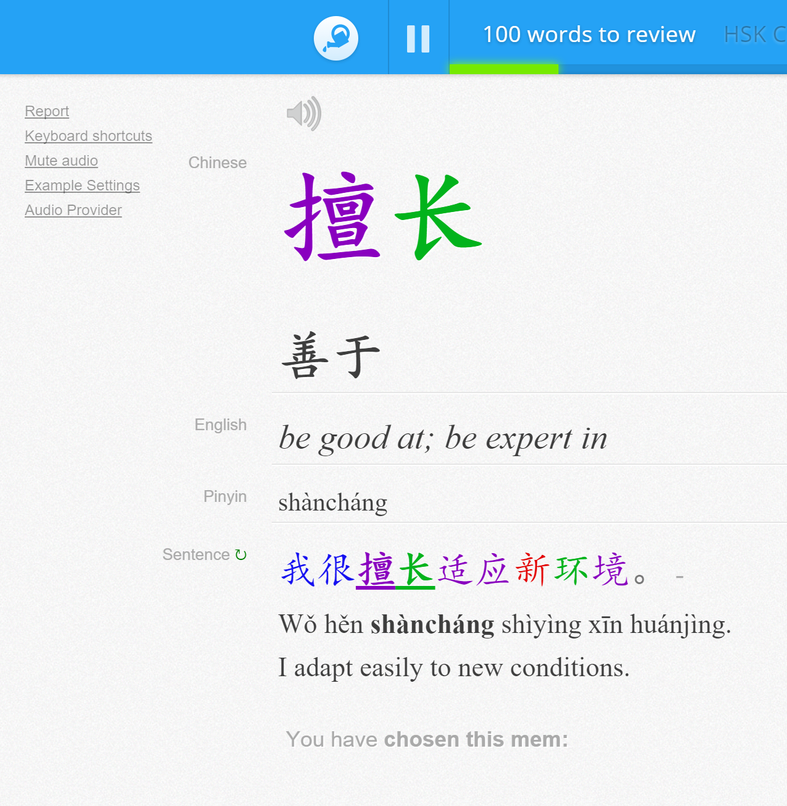
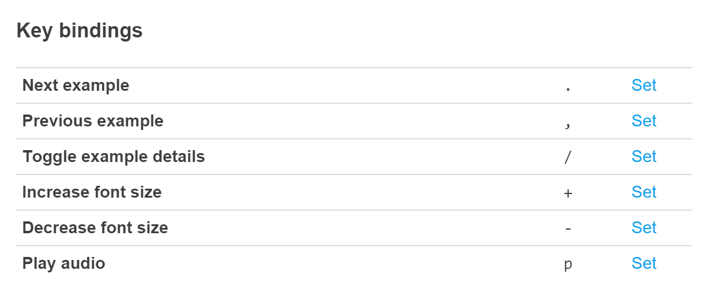

# Memrise Chinese Examples

Userscript which provides example Chinese sentences.

When reviewing new/forgotton words you get the following:

- example Mandarin Chinese sentences from LINE dictionary
- toggle to show pinyin and english translation
- navigation buttons to cycle through examples
- word colouring by HSK level or tone
- tone colouring of the word you are learning
- audio generation of the example sentence
- keyboard shortcuts:

- configuration of many aspects of the above options, the changes of which are persisted via localstorage (accessible via the 'Example Settings' link on the left)

### Installation

The easiest method is through an extension/add-on on chrome/firefox:

- Chrome: install the [Tampermonkey](https://chrome.google.com/webstore/detail/dhdgffkkebhmkfjojejmpbldmpobfkfo) extension
- Firefox: install the [Greasemonkey](https://addons.mozilla.org/en-US/firefox/addon/greasemonkey/) add-on

Then add the script using the following link: https://github.com/cooljingle/memrise-chinese-examples/raw/master/Memrise_Chinese_Examples.user.js

Memrise forum thread: http://www.memrise.com/thread/1363916/
